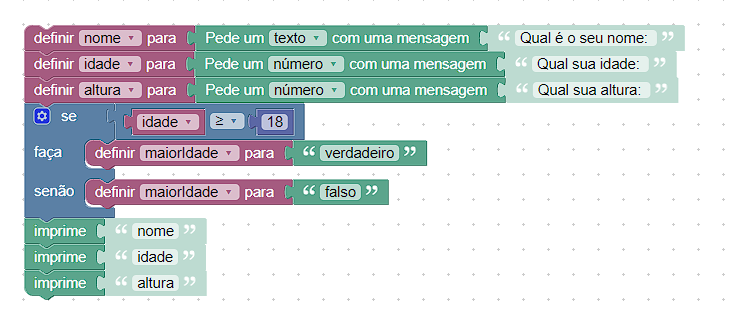

# Lógica de Programação - Desenvolvimento

## Instruções:

 
 
Construa um algoritmo no Blockly que declare as seguintes variáveis: nome, idade, altura e maior_de_idade.
Depois, atribua valores para essas variáveis, sabendo que a variável nome é uma string, a variável idade é um inteiro, a variável altura é um float e a variável maior_de_idade é um booleano. No final, imprima os valores das variáveis. 

## Resolução:




- Acesso ao Blockly - https://blockly-demo.appspot.com/static/demos/code/index.html?lang=pt-br

```

var nome, idade, altura, maiorIdade;


nome = window.prompt('Qual é o seu nome: ');
idade = Number(window.prompt('Qual sua idade: '));
altura = Number(window.prompt('Qual sua altura: '));
if (idade >= 18) {
  maiorIdade = 'verdadeiro';
} else {
  maiorIdade = 'falso';
}
window.alert('nome');
window.alert('idade');
window.alert('altura');

```